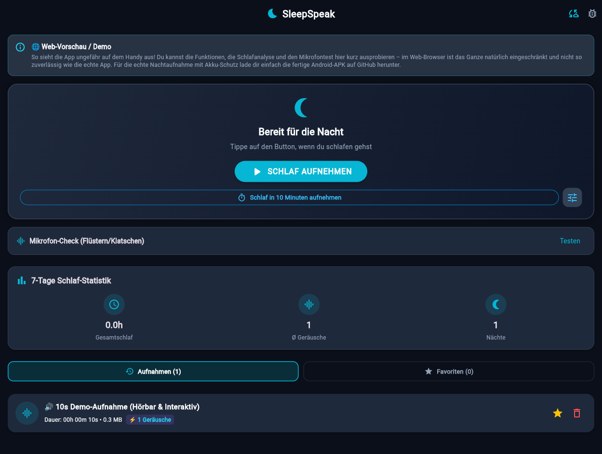
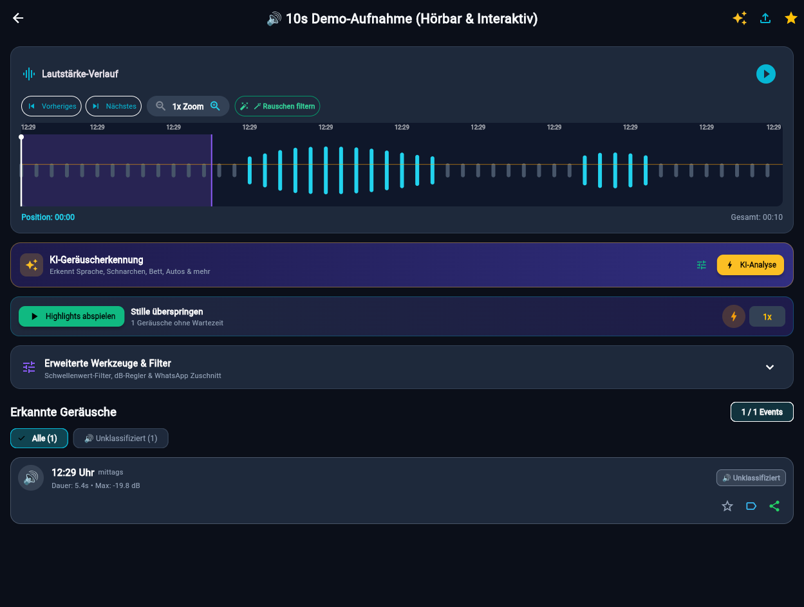
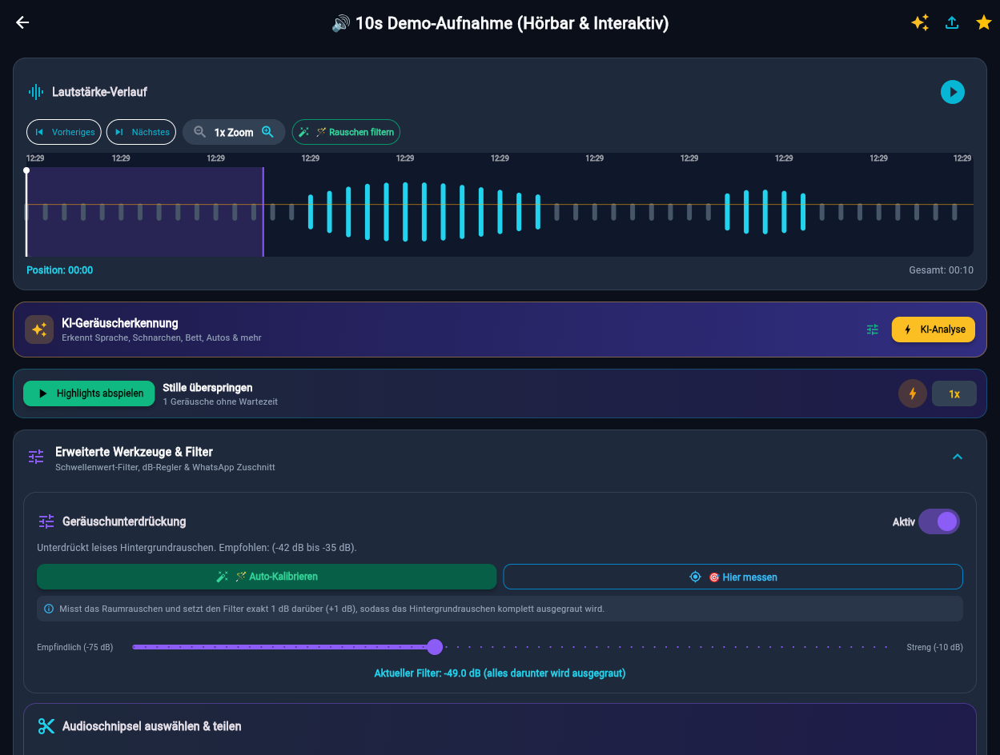

# SleepSpeak

Lokaler Audio-Recorder für Schlafreden und nächtliche Geräusche, entwickelt mit Flutter. Die App nimmt nachts Audio auf, erkennt Geräuschspitzen (Schlafreden, Schnarchen, Bewegungen) und ermöglicht das Durchhören der Segmente über eine interaktive Wellenform.

> [!WARNING]
> **Hinweis zur Web-Version:** Die Web-Vorschau ([https://zaryar.github.io/SleepSpeak/](https://zaryar.github.io/SleepSpeak/)) dient ausschließlich zu Test- und Demonstrationszwecken. Im Web-Browser sind nicht alle Funktionen getestet und Audioaufnahmen funktionieren technisch bedingt nicht zuverlässig. Die Anwendung ist für Android optimiert und funktioniert am besten als native Android-App.

---

## Screenshots

| Hauptansicht | Detailansicht & Wellenform | Filter & Kalibrierung |
| :---: | :---: | :---: |
|  |  |  |

---

## Funktionen

- **Nachtaufnahme:** 16-kHz-Mono-WAV-Aufnahme mit Foreground Service und WakeLock für Android 14+ (Doze-Mode-Kompatibilität).
- **Startverzögerung:** Einstellbarer Einschlaf-Timer (1 bis 30 Minuten, 10 Minuten Standard), damit die Aufnahme erst nach dem Einschlafen startet.
- **Audio-Klassifizierung:** Optionale Klassifizierung über Google Gemini API oder einen eigenen Whisper-Server (Schlafreden, Schnarchen, Bettbewegungen, Umgebungslärm).
- **Highlights-Player:** Automatisches Abspielen erkannter Geräusche unter Auslassung von Stillephasen mit variabler Geschwindigkeit (1.0x, 1.25x, 1.5x, 2.0x).
- **Filter & Rausch-Kalibrierung:** Einstellbarer dB-Schwellenwert bis -75 dB mit 1-Klick-Messung des Raumrauschens.
- **Clip-Export:** Automatisches Zuschneiden und Teilen einzelner Audioabschnitte als Datei.
- **Lokale Datenhaltung:** Alle Aufnahmen und Metadaten verbleiben standardmäßig auf dem Gerät.
- **Crash-Schutz:** Periodisches Speichern aller 30 Sekunden und automatisches Sichern bei kritischem Akkustand unter 5%.
- **Aufbewahrungsfristen:** Automatisches Bereinigen nicht geschützter Aufnahmen nach 7 Tagen zur Speicherplatzschonung.

---

## Architektur & Abhängigkeiten

- **Framework:** Flutter (Dart 3+)
- **Audio:** `record`, `just_audio`
- **Hintergrundbetrieb:** `wakelock_plus`, `flutter_local_notifications`
- **Systemstatus:** `battery_plus`, `permission_handler`
- **Speicherung & Teilen:** `path_provider`, `shared_preferences`, `share_plus`, `intl`
- **KI-Schnittstelle:** Bring-Your-Own-Key (BYOK) für Google Gemini oder eigene HTTP-Endpoints

---

## Installation & Ausführung

### Voraussetzungen

- Flutter SDK (3.22+)
- Android SDK mit API Level 34+

### Setup

1. Repository klonen:
   ```bash
   git clone https://github.com/zaryar/SleepSpeak.git
   cd SleepSpeak
   ```

2. Abhängigkeiten laden:
   ```bash
   flutter pub get
   ```

3. Tests ausführen:
   ```bash
   flutter test
   ```

4. Release-APK bauen:
   ```bash
   flutter build apk --release
   ```

---

## KI-Konfiguration

Die App enthält keine fest hinterlegten API-Schlüssel oder Server-URLs. Für die KI-Analyse stehen zwei Optionen in den App-Einstellungen zur Verfügung:

1. **Google Gemini (Direktmodus):** Kostenlosen Gemini API-Key in den Einstellungen hinterlegen.
2. **Eigener Server (Whisper):** Eigene Server-URL und optionalen X-API-Key eintragen.

Ohne hinterlegten Key funktioniert die lokale Rauscherkennung und Wellenform-Analyse uneingeschränkt offline.

---

## Berechtigungen

| Berechtigung | Zweck |
| :--- | :--- |
| `RECORD_AUDIO` | Aufnahme des Schlaf-Audios über das Mikrofon |
| `FOREGROUND_SERVICE_MICROPHONE` | Unterbrechungsfreie Aufnahme bei gesperrtem Bildschirm auf Android 14+ |
| `WAKE_LOCK` | Verhindert das Einfrieren der Audioverarbeitung im Standby |
| `POST_NOTIFICATIONS` | Laufende Status-Benachrichtigung während aktiver Aufnahmen |

---

## Lizenz

Dieses Projekt ist unter der [MIT License](LICENSE) lizenziert.
